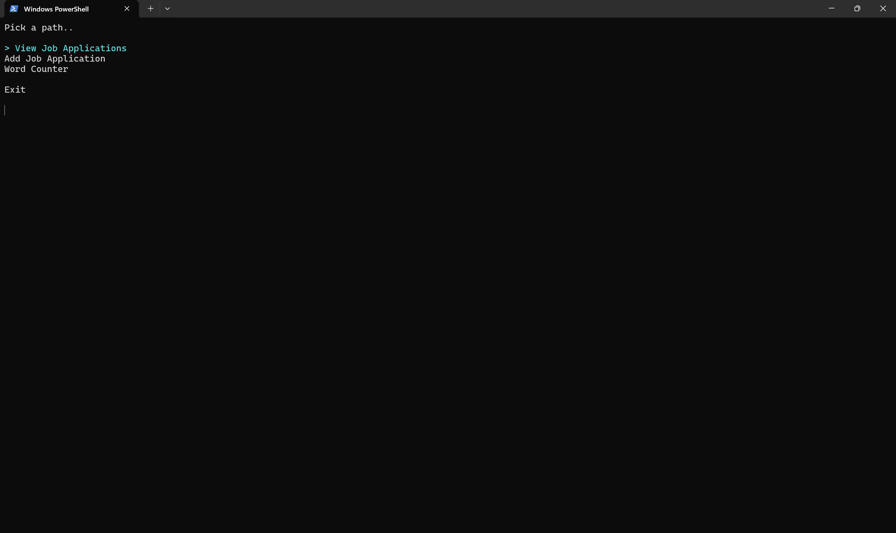
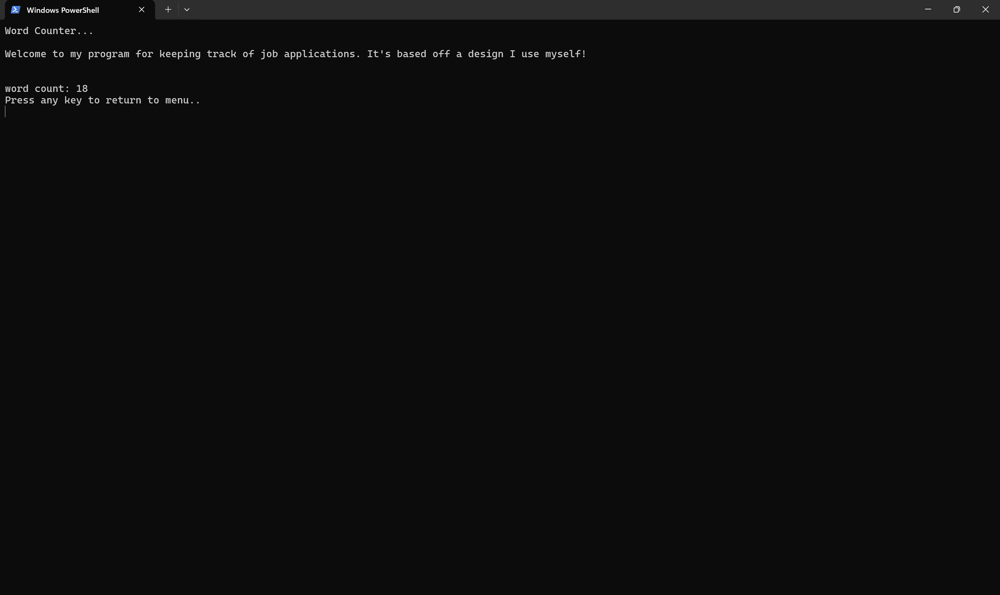
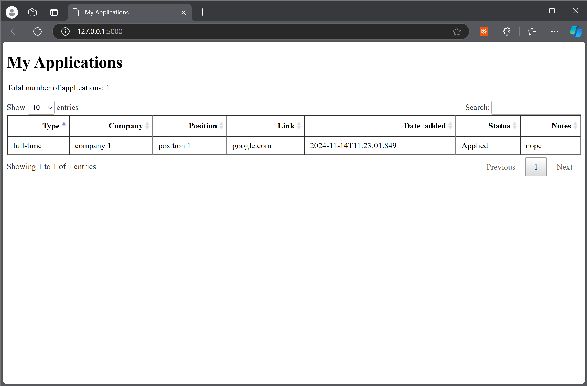

# Job Hunt Program

*A small program to aid in job search.*

Job seeking in tech can be a grueling process, requiring one to cast a wide net of applications. While taking a break from my own applications, I made this dotnet console application to encompase the information you need to keep track of it all.

  

## Features

### Word Count
> Quickly calculate response length for open response questions.

  

A quick C# funciton to count words in open responses. Just paste your response in the terminal.

### Add Application
> Update your application dataset with questionaire in the terminal.

Questionaire in terminal using Julia. After completing the questionaire, the a new entry is added to the dataset with this information.

**Application inputs**
- Type (full-time, part-time, internship, etc.)
- Company
- Position
- Application Link
- Did you apply (y/n)
- Notes

### View Applications
> Easily view, search, and sort your current dataset of applications.

  

Runs python script to create a simple web application, displaying current dataset and allowing for searching/sorting dataset view.

# Languages + Technology
> I had fun getting creative with a few different languages and technology.

- C#
  - Main menu
  - Word count

- Python
  - View applications dataset with dynamic Flask web application.

- Julia
  - Add application to dataset with questionaire in the terminal.
